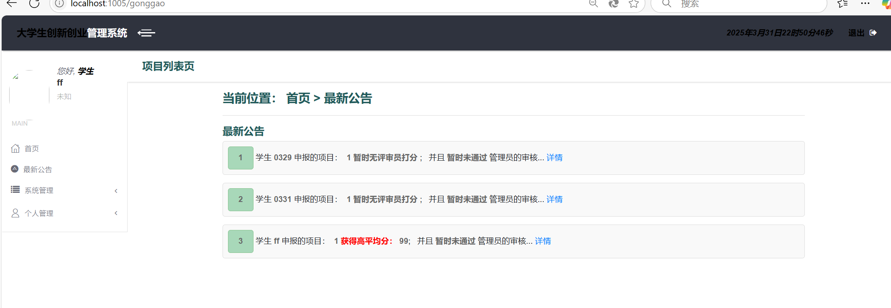
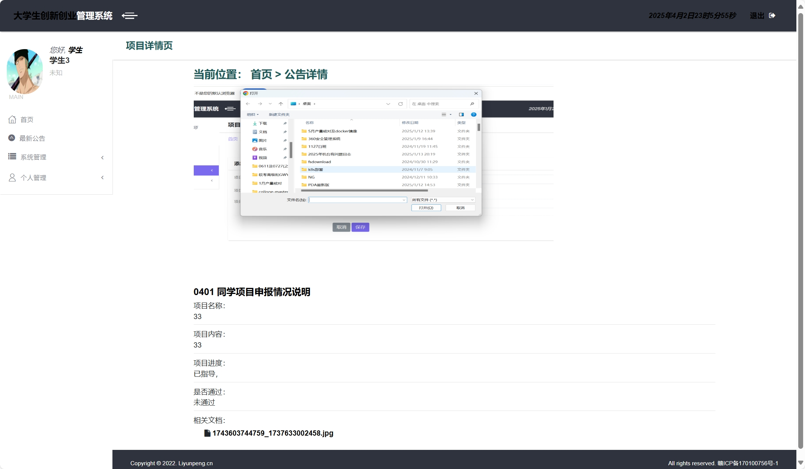
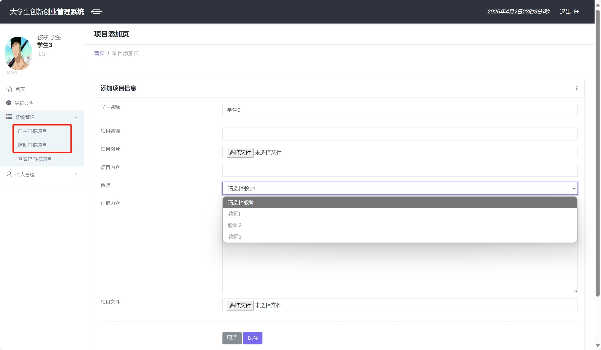
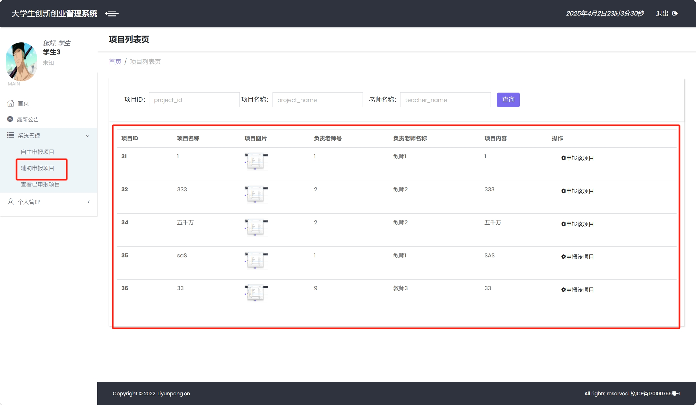
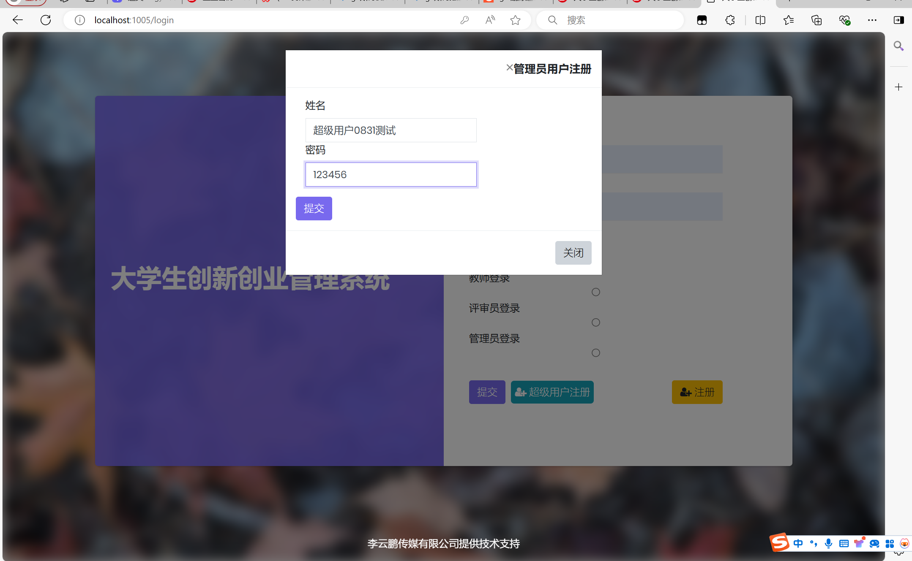
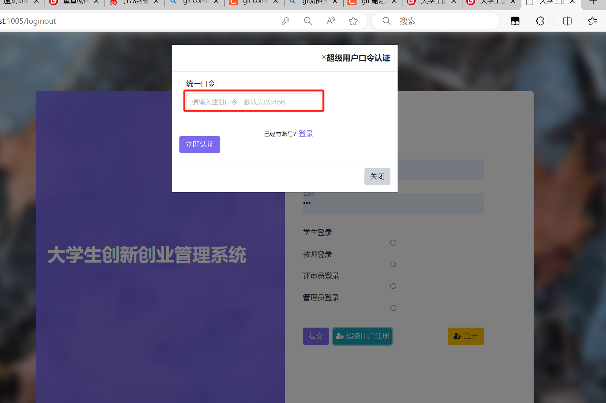
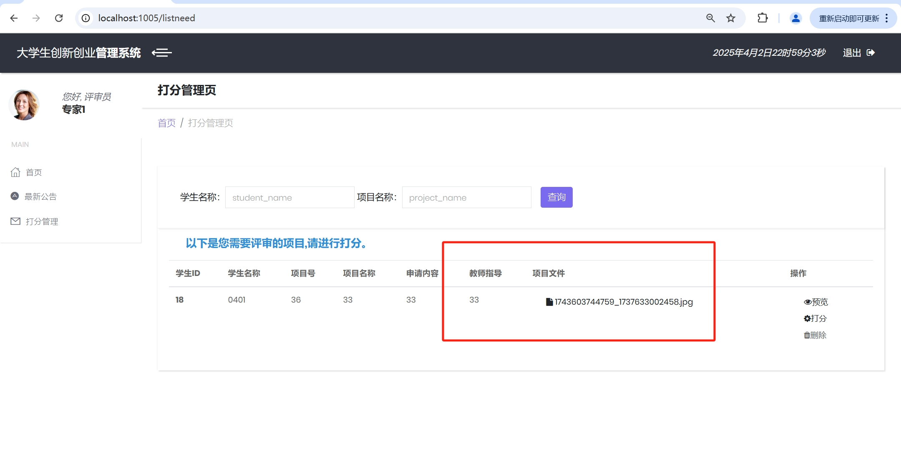

### 写在前面
已经毕业一年多了，很久没来这里看自己的东西了，收到不少网友关于项目如何部署的帖子，我以为只要代码放上去，即使环境有点偏差，大家也能调试出来，毕竟简单。 为了方便网友部署，博主手把手亲自教。如果觉得有用的可以点个赞，另外也可以+V bashTough ，提供系统架构讲解资料，ER图等资料。一起讨论计算机科学与技术的哪些知识，包含计算机网络、c/Java/php程序语言、数据库设计、web程序开发、 软件系统业务研究、linux应用、shell自动化编程等知识；逐步深入IT信息行业，成为软件行业的拥护者。

## collogecourse
皇家理工大学：大学生创新创业管理系统。这是一个SpingBoot框架写的管理系统，针对大学生创新创业项目的管理，完成了项目的申报、指导、评审等过程。 项目设计技术点：Java、SSM、SpringBoot、MybatisPlus、Jquery、Ajax、Thymeleaf模板、Apache Poi办公文件导入导出。

### 功能介绍
系统功能模块简单(可以个性化定制需求）。
#### 更新说明（2025年3月28日更新，本次更新包含登录界面样式更改、学生自主申报功能增加、最新公告模块新增、评审员打分界面字段优化等，具体更改合并截图如下：
1、最新公告模块功能

#### 更新说明（2024年10月22日更新，本次更新为历史性改变，因为增加了数据表字段，优化了SQL语句，文档上传极为重要，故必须改变。后面会继续更新如下功能：
1、老师的二次指导及总结功能。
2、评审员参考学生终版项目文档和指导老师总结做出点评及打分功能。
3、部分页面优化，markdown框架引用，待读取消息功能等。
以上这些功能基本满足了该系统的业务功能。感谢支持！ :fire: ）
1、学生申报界面新增项目文档上传功能（word文档上传），学生选择不小于50兆的word文档作为自己的电子项目计划书给指导老师看，如下图：

2、教师查看学生申报项目情况时，可下载学生上传的word文档，考虑到文档名可能过长，文档名以项目计划书前10位+省略号+后缀名组成，如下图：

3、部分BUG修复，页面美观性更改，页面布局调整，裁剪了多余的换行及空白部分等。

#### 更新说明（2024年8月31日更新）
1、登录界面新增管理员注册按钮，由于大多数人不知道管理员的默认账号，故新增这个功能。点击超级用户注册弹出模态框：请输入超级用户密令，密令输入正确才可以注册管理员账号，如下图：

2、修复了部分BUG，包含管理员模块删除学生报错，提示500页面，分配评审员报错等BUG。

#### 安装教程
##### 本地手工部署
idea安装与配置
1、下载idea工具，工具里面可以直接下载JDK，或者导入JDK1.8。 

2、下载maven(下载3.6版本是最好的，别下最新的，最新的有些依赖可能找不到，如果pom.xml文件里仍有依赖报红，多加载几次，结合csdn、博客园解决，一般不会卡太久），并配置阿里云镜像，配置仓库路径，配置环境变量。 

mysql数据库安装并导入数据
1、安装mysql5.7,网上自行百度 2、创建数据库，名称study,导入数据库文件sql.txt，把后缀改为sql，或者直接复制sql内容去执行。 

3、检查application.properties，里面的信息自己去改，包括端口号、数据库名称、mysql用户名和密码，这个很简单的就不多说。 

#### 使用说明
1、登陆界面，如果CSS有点变形，可能是bootstrap样式或者前端模板有点问题，第二次登陆就是正常的，感兴趣的也可以自己去改前端页面，反正不用动后端接口就行 

2、配置文件里的路径需要改，绝对路劲都需要改成你自己的，photo所属的绝对路劲，复制你的路劲/photo，photo不要动，要不然修改头像、图片之类的会空指针。根据打印日志看问题，修改路径。 image

### 各模块功能
1、学生登录首页和申报项目 

2、教师开设项目课题、指导学生申报的项目。 

3、评审员对项目进行打分 image

4、管理员可以管理学生、老师、评审员的基本信息；可以分配学生申报的项目给哪些评审员评审，也可以根据评审员所打的分 判断是否通过该创新创业项目。其他小功能可自行摸索。

### 写在最后
对计算机软件行业感兴趣的，如web开发（Java web、php web）、系统运维（工厂linux服务器运维、docker+K8S运维）、系统实施（服务器搭建部署、需求收集、软件交付物制作）等感兴趣的可私信我。共同学习，觉得有用的可以点个赞，上传不易，感谢捐赠。）
